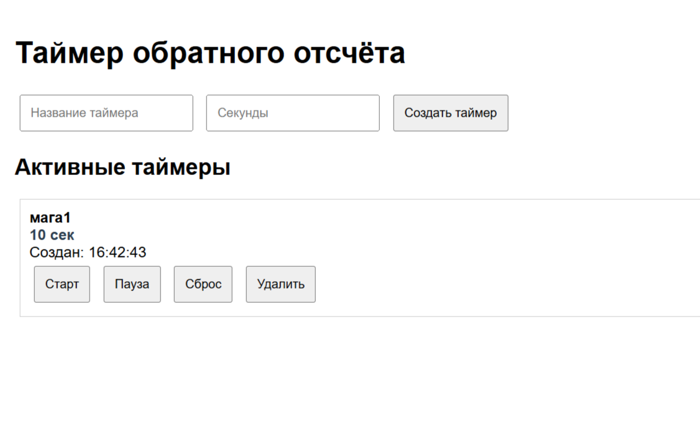

# 🕐 Timer Countdown - Express.js приложение

## 📋 Описание проекта
Веб-приложение для создания и управления таймерами обратного отсчёта. Позволяет создавать, запускать, ставить на паузу и удалять таймеры через интуитивный веб-интерфейс и REST API.

## ✨ Функциональность
- ✅ Создание таймеров с названием и временем
- ✅ Запуск/пауза/сброс таймеров
- ✅ Визуальный обратный отсчёт в реальном времени
- ✅ Звуковое оповещение при завершении
- ✅ REST API для управления таймерами
- ✅ Логирование всех запросов
- ✅ Адаптивный веб-интерфейс

## 🛠 Технологии
- **Backend**: Node.js + Express.js
- **Frontend**: HTML5, CSS3, Vanilla JavaScript
- **Архитектура**: MVC (Controllers + Routes)
- **Middleware**: Кастомное логгирование

## 📁 Структура проекта
```
timer-countdown/
├── server.js              # Основной файл сервера
├── package.json           # Зависимости
├── .gitignore            # Игнорируемые файлы
├── README.md             # Документация
├── public/               # Статические файлы
│   └── index.html        # Веб-интерфейс
├── routes/               # Маршруты API
│   └── timerRoutes.js    # Маршруты таймеров
├── controllers/          # Контроллеры
│   └── timerController.js# Логика работы с таймерами
├── middlewares/          # Middleware
│   └── logMiddleware.js  # Логгирование запросов
└── screenshots/          # Скриншоты работы
```


*Рисунок 1: Главный интерфейс приложения*


*Рисунок 2: Ответ от REST API*

## 🌐 Доступные эндпоинты

### Веб-интерфейс
- `GET /` - Главная страница с интерфейсом таймеров

### REST API
- `GET /api/health` - Проверка работы сервера
- `GET /api/timers` - Получить все таймеры
- `GET /api/timers/active` - Получить активные таймеры
- `GET /api/timers/:id` - Получить таймер по ID
- `POST /api/timers` - Создать новый таймер
- `PUT /api/timers/:id` - Обновить таймер
- `DELETE /api/timers/:id` - Удалить таймер

